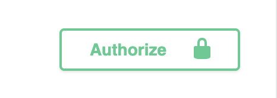
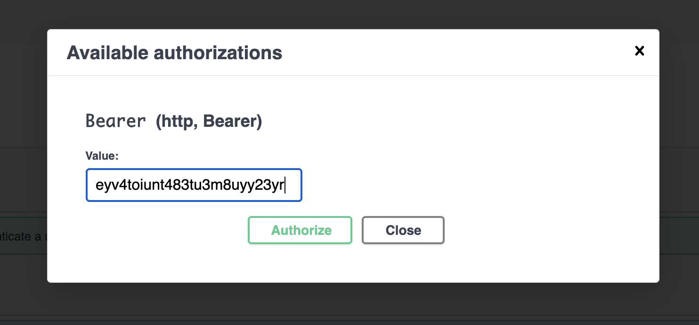

# nginx-logs-parser-api
REST API to filter NGINX logs based on user's IP address (_exact-match based query_) and request timestamp (_range-match based query_). Users will be able to login using an email/password based authentication system, which is developed using Amazon Cognito.

## Documentation
Documentation of this API has been written using Swagger-UI, so users can test it before integration. The Swagger-UI documentation is written using JSDoc so that it becomes a part of the code and is therefore maintained regularly.

You can test the deployed API using Swagger-UI interface [here](http://bit.ly/apiDocs).

## How to test the deployed API?
_Note: There exists no endpoint to register a new user, therefore a default user was created whose credentials are provided in the authentication endpoint's example._ 

### Authorization
Use the generated credentials to get ID token of the user and store that ID token (_without the "Bearer"_) in Swagger-UI. Once you do that, you'll be able to use the other two endpoints to get NGINX logs.

 

### NGINX logs

Usage of the other two endpoints is self-explainatory. Example queries have been provided in Swagger-UI as well.

An NGINX server has been deployed on port 80 of the server, and the API will pick logs of that server in real-time. So, you can try pinging the NGINX server a couple of times and you'll be able to view the corresponding access logs using the API immediately.
